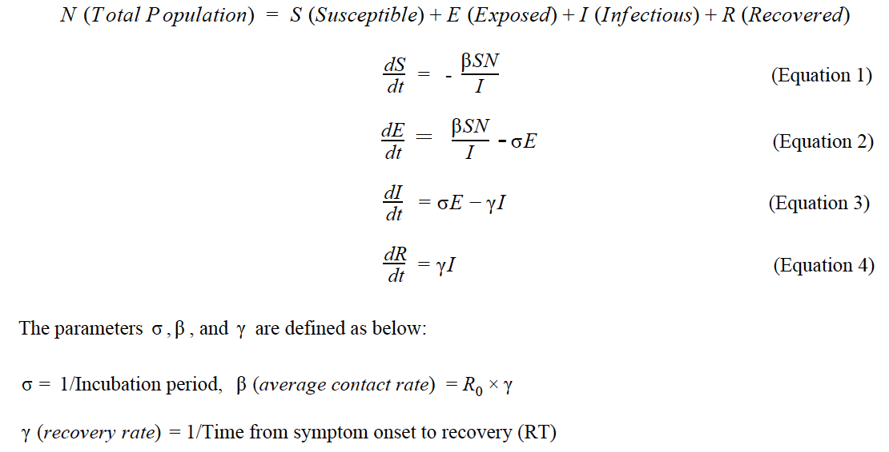
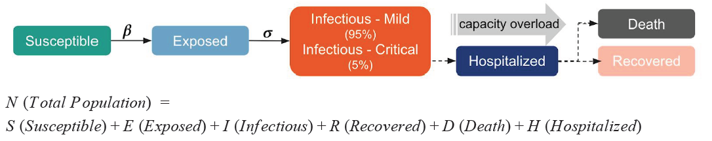
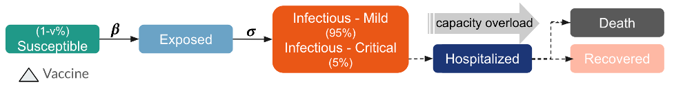

# Individual-Based COVID-19 Social Distancing Simulation

## Background
Throughout year 2020, the world is experiencing a pandemic from coronavirus and suffering huge loss from it. Tracing back the case scenarios in different countries and regions, we want to identify the potential ways we could do to mitigate this damage or affection process. Here we focus on three potential virus control policies: (1) social distance (2) extra hospitalization (3) vaccine injection. We want to simulate the covid19 spread dynamics under different strategies and compare their efficacy. 

To simplify the study, we mainly choose the representative New York State as our modeling sample and analyze its affection cases and hospitalization situation given various social distance mandates. 

## Data Input 

The data and estimated parameters we used for this simulation project mainly come from the resources below.

JHU Repository: As documented before 12/16/2020, the number of recovered cases is 92,735, the number of deaths is 35,941, and the number of infectious cases is 675,893 in New York State. We treated these statistics as of the initial state, and our following simulation process starts at 12/16/2020, the time unit is one single day.

World Population Review: New York State population of 19,440,500

MIDAS Research Networks: Estimated parameters with regard to covid-19 are retrieved.
- Basic reproduction rate (R_0): The average number of people who will catch a disease from one contagious person, It specifically applies to a population of people who were previously free of infection and haven’t been vaccinated. Covid-19 in New York State has an R_0 of 2.28, this is, a person who has the disease will transmit it to an average of 2.28 other people, as long as no one has been vaccinated against it or is already immune to it in their community.
- Incubation period: Time elapsed between exposure and when symptoms and signs are first apparent is 9.55.
- Recovery rate (𝛄): The inverse of time from symptom onset to recovery(RT), in New York State, it takes on average 21.02 days to recover once symptom appears, so the recovery rate we used is 1/21.02.
- Reporting Rate (RR): The latest research with confidence interval up to 95% states that the real reporting rate for COVID-19 cases is 75%. We obtained the population in the Exposed stage through Reporting Rate (75%) times the number of Infectious cases.

## Model

We utilized 3 models to simulate the Covid-19 cases in New York State. Our baseline model is SEIR, which takes in 4 different stages (Susceptible, Exposed, Infectious, and Recovered) regarding the virus spread situation. In order to make this baseline model more realistic, we also considered the death cases and hospital factor in the SEIR+DH model. Last, we incorporated the potential influence of the vaccine release in the SEIR+DHV model.

### 1.	Baseline SEIR Model 
The SEIR model divides the population into 4 groups: Susceptible, people who were never infected or vaccinated; Exposed, people who were exposed to the virus and have not shown any symptoms; Infectious, people who are infectious and Recovered, people who are recovered.

To simulate the SEIR process, for each person in S status, we simulate whether he will enter next stage with the probability of β; for each person in E status, we simulate whether he will enter next stage with the probability of σ; for each person in I status, we simulate whether he will enter next stage with the probability of γ. 

### 2.	SEIR-DH Model
Based on the baseline SEIR model, we considered death and hospitalization factors, which aligns more with reality. In this model, we divided new infectious cases into two types: (I) critically ill patients who have strong symptoms and require urgent medical care like ICU treatment; (II) non-critical ill patients who have relatively mild symptoms. We sampled two types of infectious patients, based on a normal distribution of N(5%, 0.1%) as a critical illness ratio. 

### 3.	SEIR-DHV Model
Finally, we want to measure the impact of vaccine injection on covid19 cases and predict how well the pandemic situation might improve after vaccines are allocated. We added two vaccine factors, i.e., vaccine injection date and vaccine proportion (v%)  to the previous model. At the vaccine injection date, the susceptible population is decreased by the proportion of vaccine injection ratio, leading less people to get infected later.

## Scenario Simulation

To test the robustness of our model and evaluate the sensitivity of model outputs under different settings, we analyzed two viruses with varying input parameters. Our goal is to investigate the optimal policy for controlling the pandemic according to the diverging infection property of two viruses.

To illustrate, we compared two sets of infectious diseases: (1) Coronavirus (2) Ebola, which has almost the contrary transmission property. While the Covid19 is highly infectious and tends to be less fatal to human beings, the Ebola virus is rarely spotted but more deadly to our body.

### Covid-19: highly infectious and tends to be less fatal 
From the three policies enforced on controlling coronavirus above, we see a consistent pattern that clearly the number of recovered cases is much larger than that of the death cases and the infectious cases increase rapidly and reach peak within around 50 days in all scenarios. To investigate the detail of each policy, we found the following differences:
- Social distancing policy tends to be the most effective one in terms of controlling the total death number and slowing down the rapid infection of the virus. When increasing the social distancing power from 0% to 75%, we see a large drop of death cases from 3.3 million to just 0.5 million, and a quick control of infectious cases (no more new cases) from around day 100 to only day 50. This proves the great efficacy of social distancing strategy regarding controlling the spread of virus, namely demonstrating the effect of "flattening the curve".
- Followed by that, the vaccine allocation works similarly for controlling the infectious source and thus helps flatten the curve". But we do see the efficacy of vaccine is sensitive to allocation time. If injected too late, i.e. the 120th day out of 180 period, the vaccine shows no much effect in controlling the cases since the infectious peak has passed away earlier.
- The expansion of hospitalization capacity also helps narrow down the death cases as well, but less efficiently compared to social distancing or early day vaccine allocation. This is because hospital retreatment does not help cut off the infection source but instead help fasten the recovery process and slow down the potential death. So we can see a relatively larger infectious case number but a much larger recovered population compared to the other two policies.

### Ebola: death rate is extreme with low reproduction rate
From the three policies enforced on controlling ebola above, we see an almost consistent pattern (all except one) that clearly the number of death cases now is much larger than that of the recovered cases and the peak of infectious is smaller and shorter. This is actually on the contrary of what we have observed in the coronavirus case. To investigate the detail of each policy, we found the following differences:
- Hospitalization capacity expansion tends to be the most effective one in terms of controlling the total death number and increasing the recovery cases. When enlarging the extra hospital capacity to 75%, we see a significant drop of death cases from 7.4 million to around 3 million, and the recovered case number surpassed the death case for the first time. This proves the great efficacy of extra hospitalization treatment strategy regarding reducing the high fatality risk of the virus and enhancing the recovery potential for people.
- Compared to that, the social distancing policy slightly helps shrink the death case number. But we do see recovery case number remains the same level under different social distancing control power, potentially due to the fact that reducing contact does not help lessen the high fatality rate of this virus.
- The vaccine allocation works similarity as the social distancing strategy, only slightly diminishing the death cases without affecting the recovered cases much. However, we observe an interesting fact that controlling effect is insensitive to the vaccine allocation time. We speculate that the low transmission rate and high fatality rate of ebola makes it less infectious and decays quickly after infection, thus the infection cut-off from the vaccine allocation will make less effect now.

## Conclusion
1.	We discussed 3 different policies: social distancing, vaccine allocation and extra hospitalization capacity. Among them, different policy appear to be the optimal ones regarding different virus: (1) social distancing is the most effective policy in terms of reducing potential death for coronavirus, followed by vaccine allocation; (2) for ebola, the enlargement of hospitalization capacity tends to work the best for improving the recovery process and controlling fatal death.
2.	To explain the diverging optimal policy under two virus, we propose the potential reasons as follows: 
(1) When the virus is indeed highly infectious while less fatal (i.e., coronavirus), it is more efficient to just control the close contact within the population so that the source of infected population will largely decrease. Similarly, getting proper vaccine injection will also help control the infection source and alleviate the pandemic transmission effectively. Since the fatality rate is relatively lower, the extra hospitalization capacity for slowing down the fatality rate and improving the recovery process tends to be less productive when compared to the previous two policies.
(2)  In contrast, when the virus is less infectious but more fatal (i.e., ebola), adding extra health care capacity to alleviate the death process and promote the recovery possibility of each patient is proved to be more successful. Since the low infection rate makes the virus less sensitive to the infection process cut-off from social distancing and vaccine allocation, these two policies are less efficient than the hospitalization expansion.

## Business Recommendation

We found interesting varieties in the optimal policy under different viruses and different transmission property scenarios. Before the simulation, it is naturally to assume that those three policies should all work well at the same level for controlling any virus and the media tend to propagate the idea that the more controlling policies the better. However, in reality, usually the reaction time to a pandemic is limited for the government, let alone saying the alleviation resource for saving the situation for the first time is restricted as well. That being said, we suggest the government to first thoroughly investigate the virus disease and understand its key transmission property before making the optimal policy for pandemic control. Specifically, the decision maker or the countrywide health organization could consider using simulation to predict the potential scenarios and evaluate the efficiency of different policies. This first step might be painful and time-consuming at first thought (thus also usually tend to be neglected by the government), but it indeed helps save tons of time compared to making a non-optimal policy and also might bring back potentially millions of lives later.
